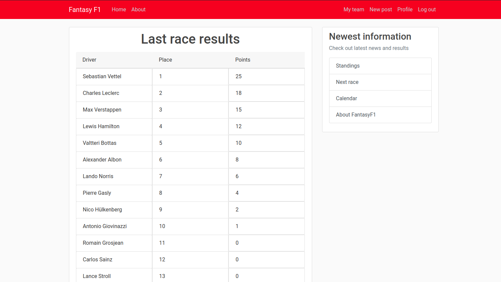

<!--
*** Thanks for checking out this README Template. If you have a suggestion that would
*** make this better, please fork the fantasy_f1 and create a pull request or simply open
*** an issue with the tag "enhancement".
*** Thanks again! Now go create something AMAZING! :D
***
***
***
*** To avoid retyping too much info. Do a search and replace for the following:
*** Haelmorn, fantasy_f1, twitter_handle, email
-->


<!-- PROJECT SHIELDS -->
<!--
*** I'm using markdown "reference style" links for readability.
*** Reference links are enclosed in brackets [ ] instead of parentheses ( ).
*** See the bottom of this document for the declaration of the reference variables
*** for contributors-url, forks-url, etc. This is an optional, concise syntax you may use.
*** https://www.markdownguide.org/basic-syntax/#reference-style-links
-->
[![Contributors][contributors-shield]][https://github.com/Haelmorn/fantasy_f1/graphs/contributors]
[![Forks][forks-shield]][https://github.com/Haelmorn/fantasy_f1/network/members]
[![Stargazers][stars-shield]][https://github.com/Haelmorn/fantasy_f1/stargazers]
[![Issues][issues-shield]][https://github.com/Haelmorn/fantasy_f1/issues]
[![MIT License][license-shield]][license-url]


<!-- PROJECT LOGO -->
<br />
<p align="center">
  <a href="https://github.com/Haelmorn/fantasy_f1">
    
  </a>

  <h3 align="center">Fantasy F1</h3>

  <p align="center">
    This is a simple, Flask-based web app that is supposed to imitate the popular Fantasy Football game, F1 style.
    <br />
    <a href="https://github.com/Haelmorn/fantasy_f1"><strong>Explore the docs »</strong></a>
    <br />
    <br />
    <a href="http://fantasyf1-haelmorn.herokuapp.com/">View Demo</a>
    ·
    <a href="https://github.com/Haelmorn/fantasy_f1/issues">Report Bug</a>
    ·
    <a href="https://github.com/Haelmorn/fantasy_f1/issues">Request Feature</a>
  </p>
</p>


<!-- TABLE OF CONTENTS -->
## Table of Contents

* [About the Project](#about-the-project)
  * [Built With](#built-with)
* [Getting Started](#getting-started)
  * [Prerequisites](#prerequisites)
  * [Installation](#installation)
* [Usage](#usage)
* [Roadmap](#roadmap)
* [Contributing](#contributing)
* [License](#license)
* [Contact](#contact)
* [Acknowledgements](#acknowledgements)


<!-- ABOUT THE PROJECT -->
## About The Project



This project was created to get a basic understanding of Flask and some kind of SQL-like database (this turned out to be postgreSQL). Another thing was getting more comfortable with deploying apps in Docker, building docker images, Dockerfiles etc.
The project revolved around giving an user the ability to create his own profile, add posts, make his own team composed of F1 drivers and have his team score points based on drivers performance over the course of the season.

This project is still a WIP, hence it still suffers from the lack of some key features:
* Awarding points to teams
* Some routes, for example the Scoreboard and full fledged About page
* Many utilities essential for a good experience with the "Fantasy" part of the app: editing your team, concise scoring rules etc.

### Built With

* [Flask](https://palletsprojects.com/flask)
* [PostgreSQL](https://www.postgresql.org/)
* [Jinja2](https://jinja.palletsprojects.com/en/2.10.x/)
* [WTForms](https://wtforms.readthedocs.io/en/stable/)


<!-- GETTING STARTED -->
## Getting Started

To get a local copy up and running follow these simple steps.

### Prerequisites
IMPORTANT: This section of the docs only refers to Linux-based systems. If you are running MacOS or Windows, you may need to alter some commands for the project to work properly. Installation tutorial for both systems should be available soon.

To run this project, you will need pip. It should be installed by default, if you are running python 3.4+.
If you don't have it, then run:
```sh
sudo apt-get install python3-pip
```
I also highly recommend using a virtual environment.
To get virtualenv, run the following:
```sh
pip install virtualenv
```

### Installation
0. Create and activate your virtualenv (optional)
```sh
virtualenv venv
source venv/bin/activate
```
1. Clone the fantasy_f1
```sh
git clone https:://github.com/Haelmorn/fantasy_f1.git
```
2. Install pip packages
```sh
pip install -r requirements.txt
```
#### Seting up the database
1. Install PostgreSQL on your machine
```sh
sudo apt-get install postgresql postgresql-contrib
```
2. Create supersuer for PostgreSQL
```sh
sudo -u postgres createuser --superuser name_of_user
```

<b>Before going any further, make sure you have your virtual environment active. If it's not activated, your app won't be able to access the database</b>

3. Create your database
```sh
sudo -u name_of_user createdb name_of_database
```

Your database can be now accessed with the following command
```sh
psql -U name_of_user -d name_of_database
```
4. Export database URI as environmental variable
```sh
export DATABASE_URL="postgresql:///name_of_database"
```

5. Initialise the database with manage.py
```sh
python manage.py db init
```
6. Migrate and upgrade the database
```sh
python manage.py db migrate
python manage.py db upgrade
```

<!-- USAGE EXAMPLES -->
## Usage

To get the app going, run
```sh
python manage.py runserver
```
Then, visit 127.0.0.1:5000 in your browser.


<!-- ROADMAP -->
## Roadmap

See the [open issues](https://github.com/Haelmorn/fantasy_f1/issues) for a list of proposed features (and known issues).


<!-- CONTRIBUTING -->
## Contributing

Contributions are what make the open source community such an amazing place to be learn, inspire, and create. Any contributions you make are **greatly appreciated**.

1. Fork the Project
2. Create your Feature Branch (`git checkout -b feature/AmazingFeature`)
3. Commit your Changes (`git commit -m 'Add some AmazingFeature'`)
4. Push to the Branch (`git push origin feature/AmazingFeature`)
5. Open a Pull Request


<!-- LICENSE -->
## License

Distributed under the MIT License. See `LICENSE` for more information.


<!-- CONTACT -->
## Contact

Karol Ciuchciński - [@twitter_handle](https://twitter.com/twitter_handle) - k.ciuchcinski@outlook.com

Project Link: [https://github.com/Haelmorn/fantasy_f1](https://github.com/Haelmorn/fantasy_f1)


<!-- ACKNOWLEDGEMENTS -->
## Acknowledgements
Special thanks to:
* [Corey Schafer and his amazing youtube channel](https://www.youtube.com/channel/UCCezIgC97PvUuR4_gbFUs5g)
* [This amazingly informative blog post and it's author](https://medium.com/@dushan14/create-a-web-application-with-python-flask-postgresql-and-deploy-on-heroku-243d548335cc)
* [Heroku](heroku.com)


<!-- MARKDOWN LINKS & IMAGES -->
<!-- https://www.markdownguide.org/basic-syntax/#reference-style-links -->
[contributors-shield]: https://img.shields.io/github/contributors/othneildrew/Best-README-Template.svg?style=flat-square
[contributors-url]: https://github.com/othneildrew/Best-README-Template/graphs/contributors
[forks-shield]: https://img.shields.io/github/forks/othneildrew/Best-README-Template.svg?style=flat-square
[forks-url]: https://github.com/othneildrew/Best-README-Template/network/members
[stars-shield]: https://img.shields.io/github/stars/othneildrew/Best-README-Template.svg?style=flat-square
[stars-url]: https://github.com/othneildrew/Best-README-Template/stargazers
[issues-shield]: https://img.shields.io/github/issues/othneildrew/Best-README-Template.svg?style=flat-square
[issues-url]: https://github.com/othneildrew/Best-README-Template/issues
[license-shield]: https://img.shields.io/github/license/othneildrew/Best-README-Template.svg?style=flat-square
[license-url]: https://github.com/othneildrew/Best-README-Template/blob/master/LICENSE.txt
[linkedin-shield]: https://img.shields.io/badge/-LinkedIn-black.svg?style=flat-square&logo=linkedin&colorB=555
[linkedin-url]: https://linkedin.com/in/othneildrew
[product-screenshot]: images/screenshot.png
